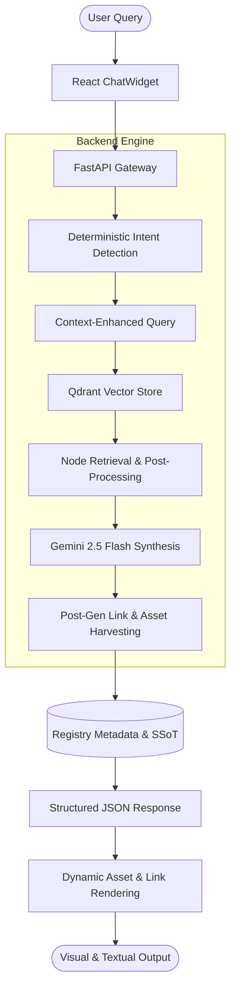

# LIFE Design Festival 2026 - AI Curator Technical Infrastructure

This repository contains the full-stack architecture for the LIFE Design Festival 2026 AI Curator. The system is a sophisticated Retrieval-Augmented Generation (RAG) platform designed to deliver high-fidelity information, editorial-grade visual assets, and deterministic entity linking.

---

## 1. System Architecture and Data Flow

The infrastructure is built on a "Registry-First" paradigm, ensuring that semantic AI synthesis is always anchored to a deterministic Single Source of Truth (SSoT).

### 1.1 RAG Pipeline Diagram



### 1.2 How It Works
The system bypasses traditional RAG hallucinations through three layers of validation:
1.  **Intent Classification**: Every message is analyzed for specific intents (e.g., social, lodging, program, sponsor). This classification triggers mandatory metadata injections.
2.  **Registry-First Retrieval**: If an intent is detected, the engine forces the inclusion of "Registry Nodes" (Metadata blocks) into the LLM context, overriding standard vector proximity.
3.  **Deterministic Harvesting**: A specialized post-processor intercepts the LLM output, extracting unique [[REF:id]] tags to fetch validated URLs and high-resolution assets from a protected internal registry.

---

## 2. Backend Subsystem (Python / AI Engine)

Located in the `/backend` directory, this service manages the intelligence and data retrieval layers.

### 2.1 Core Technologies
- **Framework**: FastAPI (Asynchronous API gateway).
- **RAG Orchestrator**: LlamaIndex (CondensePlusContext mode).
- **Vector Database**: Qdrant Cloud (HNSW indexing for sub-second retrieval).
- **Inference Model**: Google Gemini 2.5 Flash (via OpenRouter).

### 2.2 Technical Features
- **Adaptive Top-K**: Retrieval depth dynamically scales (from 20 to 40 nodes) based on query complexity (e.g., full program requests).
- **Similarity Post-Processing**: Cutoff threshold of 0.25 to ensure optimal context relevance while maintaining coverage.
- **Titanium Link Logic**: Pre-loaded static link mapping to ensure 100% button reliability regardless of LLM tokenization.
- **Security**: CORS-protected origins and environmental credential management.

---

## 3. Frontend Subsystem (React / UI-UX)

The frontend is a high-performance Single Page Application (SPA) designed for editorial-grade interactions.

### 3.1 Core Technologies
- **Foundation**: React 18, TypeScript, Vite.
- **Animations**: GSAP (ScrollTrigger) for smooth editorial scrolling; Framer Motion for UI state transitions.
- **Scrolling**: Lenis Scroll integration for high-fidelity boutique navigation.
- **Styling**: Tailwind CSS for structural layout; Vanilla CSS for complex interactive components.

### 3.2 UI Integration
- **ChatWidget.tsx**: Manages asynchronous communication with the backend and handles complex state for galleries and links.
- **Asset Rendering**: Adaptive logic differentiates between "Composite Galleries" (for broad timeframe queries) and "Single Portraits" (for specific entity queries).
- **Mobile Optimization**: Specialized floating-action-button (FAB) entry point for small-screen users.

---

## 4. Project Structure

```text
.
├── backend/                  # Python Infrastructure
│   ├── core/                 # RAG Engine, Logic & Configuration
│   ├── knowledge/            # Markdown Registries (Source of Truth)
│   ├── main.py               # API Entrypoint
│   └── requirements.txt      # Linux-optimized dependencies
├── src/                      # Frontend Application
│   ├── components/           # UI Components (Chat, Paint, Navbar)
│   ├── hooks/                # GSAP, Lenis & Scroll Animations
│   ├── data/                 # Static Festival Mapping
│   └── pages/                # High-level View Composition
├── public/                   # Production Static Assets
├── .vercelignore             # Build Optimization for Vercel
├── vercel.json               # Vercel Deployment Configuration
└── README.md                 # Technical Documentation
```

---

## 5. Deployment and Maintenance

### 5.1 Environment Configuration
The system requires the following variables for production stability:
- `QDRANT_URL`: Vector database endpoint.
- `QDRANT_API_KEY`: Vector store authentication.
- `OPENROUTER_API_KEY`: LLM inference gateway.
- `VITE_API_URL`: Target production backend URL (Injected at build time).

### 5.2 Hosting Strategy
- **Backend**: Render.com (Web Service - Linux).
- **Frontend**: Vercel (Production and Preview pipelines).
- **Reliability**: External ping intervals are configured to prevent cold-start latency on free-tier infrastructure.
